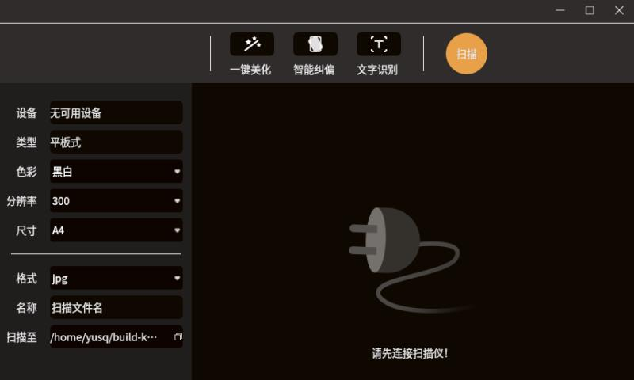

# kylin-scanner
Kylin Scanner is an interface-friendly scanning software developed with Qt5.
The software can scan according to the resolution, size and color mode of
the scanning device itself. At the same time, It Increases post-processing of scanned pictures,
including one-click beautification, intelligent correction and text recognition.
Other image processing tips can also be reflected in this software, such as clipping, rotation, etc.



## Author's Home page
:point_right:  [yusq77](https://yusq77.github.io/)

## Function lists
- [x] Normal scanning(different device, type, resolution, size, color mode, formats)
- [x] One-clicked beautification
- [x] Intelligent correction
- [x] text recognition OCR
- [x] Image processing: clipping, rotation, watermarking, symmetry, etc
- [x] Send email
- [x] Save as multi-formats contents

## Ubunty Environments
``` bash
# opencv essential
sudo apt install libopencv-dev

# sane essential
sudo apt sane sane-utils xsane libsane-dev libsane

# OCR essential
sudo apt install tesseract-ocr tesseract-ocr-eng tesseract-ocr-chi-sim libleptonica-dev libtesseract-dev

# For gio-unix-2.0
sudo apt install libglib2.0-dev
```

## Report bugs
Bugs should be report to the kylin-scanner bug tracking system: https://github.com/yusq77/kylin-scanner
